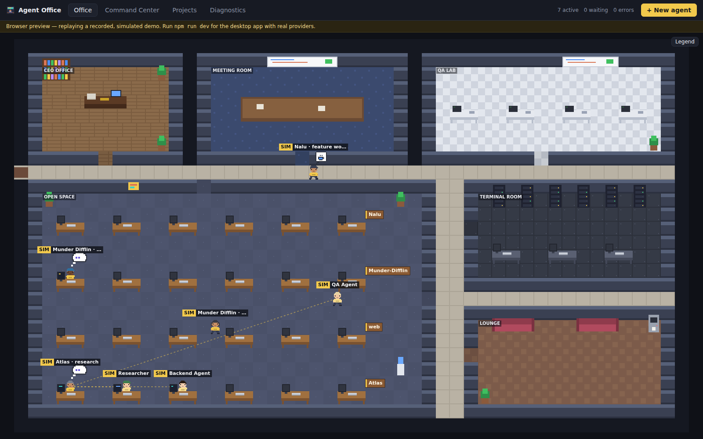

# Agent Office

**Agent Office** is a native Windows desktop app that shows the AI coding agents you
have running — Claude Code, OpenAI Codex CLI and Cursor CLI — as characters in a
living pixel-art office. Each session is an employee: you can see who is coding, who
is running tests, who is waiting for your permission and who just hit an error, and
you can act on them when the provider allows it.

> **Status: early development (Phase 8 of 10).** The desktop shell, unified event
> pipeline, SQLite storage, provider detection, a clearly-labelled *demo* provider,
> **Claude Code** and **Codex CLI** (sessions launched from the app, and sessions
> in your own terminal through hooks) work. **Cursor CLI** sessions launched from
> the app are implemented as *experimental*: built from the official Agent Client
> Protocol and tested without a real Cursor, which still has to be checked on
> Windows 11. See [docs/ROADMAP.md](docs/ROADMAP.md).



## What it is

* A **pixel-art office** where every agent session is a character, subagents are
  extra employees linked to their lead, and rooms reflect activity (desks, terminal
  area, QA, meeting room, lounge, CEO office).
* **Reading the office:** each project gets its own row of desks with a name plate,
  and subagents sit next to their lead (a lighter shirt of the same color). What a
  character does shows in its pose and on its screen: typing code, reading, a
  thought cloud, a raised hand with a red **!** when it needs your permission,
  hands on the head after an error. Long commands send it to the terminal room,
  tests to the QA lab, waiting for a prompt to the lounge. Hover a character (or
  use the arrow keys) for a summary, click it for the full panel; **Legend**
  explains every symbol.
* A **Command Center** view: active agents, waiting approvals, errors, completed
  tasks, projects, branches, tool calls and token usage.
* A **provider-agnostic platform**: every provider is an adapter that turns its
  official events (hooks, JSON-RPC protocols, stream-json) into one unified event
  model. The UI never sees provider-specific data.
* **Local-first**: no accounts, no cloud, no telemetry. Data stays in
  `%LOCALAPPDATA%\AgentOffice`.

## Supported providers

| Provider | Managed sessions (launched by the app) | External sessions (your own terminal) |
| --- | --- | --- |
| Claude Code | `claude -p` stream-json + hooks | Global hooks in `%USERPROFILE%\.claude\settings.json` (install/uninstall/repair from the app) |
| OpenAI Codex CLI | `codex app-server` (JSON-RPC) | Hooks in `%USERPROFILE%\.codex\hooks.json` (needs one-time trust via `/hooks` in Codex) |
| Cursor CLI | `agent acp` (Agent Client Protocol) — experimental; run `agent login` once first | Not yet (Cursor's hook format could not be verified) |

The exact, honest list of what each provider supports is in
[docs/PROVIDER_CAPABILITIES.md](docs/PROVIDER_CAPABILITIES.md). When a provider
does not expose something (for example token usage for external sessions), the app
shows **"Unavailable"** instead of guessing.

## Installation

End users (once Phase 10 ships): download and run **`AgentOfficeSetup.exe`**. It
installs Agent Office with a Start Menu entry, an optional desktop shortcut and an
uninstaller. Nothing else is required — no Node, Rust, Python, WSL or Bash. The
installer uses the WebView2 runtime that ships with Windows 11.

You need the agent CLIs you want to watch installed as usual (`claude`, `codex`,
`agent`). Agent Office detects them automatically.

## Watching Claude Code

1. Open **Diagnostics** and press **Install hooks** next to Claude Code (confirm).
   Agent Office adds its entries to `%USERPROFILE%\.claude\settings.json`, keeps
   everything else, and saves a backup next to the file first.
2. Run `claude` in any terminal: a character appears and follows what it does.
3. Or press **New agent** → Claude Code to launch a session from the app; it takes
   prompts from the agent panel and asks you to Approve / Reject tool use there.

Permission prompts of sessions in your own terminal are only *shown* by default. Turn
on *Answer permission requests of external sessions* in Diagnostics → Settings to
answer them from the app (Claude shows its own prompt if you don't answer in time).

## Watching Codex CLI

1. In **Diagnostics**, press **Install hooks** next to Codex CLI (confirm). Agent
   Office adds its entries at the end of `%USERPROFILE%\.codex\hooks.json`.
2. Codex asks you to review new hooks: open `codex`, type `/hooks` and trust the
   Agent Office entries. Until then Diagnostics shows *Needs your action* and
   Codex runs none of them.
3. Sessions you start with `codex` now appear in the office. **New agent** →
   Codex CLI launches a session from the app, with Approve / Reject for its
   commands and file changes.

## Controlling agents

Click a character to open its panel. What you can do depends on the provider
and on who started the session (buttons that do not apply are greyed out, with
the reason in their tooltip):

* **Stop** — sessions started from Agent Office: asks the agent to finish (up to
  10 s), then ends it and everything it started.
* **Restart** — Claude Code and Codex sessions started from Agent Office:
  continues the *same conversation* in a new process, in the same folder, with
  the same model and permission mode (it stops the agent first if it is still
  running, and asks you once more before doing so). Not available for Cursor yet.
* **Open terminal** — any session whose folder exists on this computer: opens
  your terminal (Windows Terminal, else PowerShell) in that folder. It is yours:
  Agent Office types nothing into it and never closes it.
* **No news for N minutes** — when a busy agent has not reported anything for a
  while (5 minutes by default; Diagnostics → Settings), it shows an hourglass in
  the office and a note in its panel. It may just be running a long build, so
  Agent Office never stops it on its own.

The panel also shows the process ID, how many times the session was restarted,
and why it ended ("finished", "exited with code 1", "stopped by Agent Office", …).
Diagnostics → *Processes started by Agent Office* lists every agent process the
app started, with its status and how many processes are running under it.

## Git

Agent Office reads the Git repositories your agents work in with your own
Git (it never changes them):

* The agent panel shows the repository, branch (or worktree), changes not
  staged / staged / new, how far the branch is ahead of or behind its
  upstream, and the commits that agent made.
* **Projects** shows a card per repository: branch, changed files, recent
  commits and worktrees, refreshed every 15 seconds while you look at it.
* A file shows "written by" an agent only when that agent's tool wrote it, and
  a commit shows "by" an agent only when that agent ran the `git commit`.
  Everything else is shown without a name: Agent Office does not guess.
* **Open project** opens the folder; **Show** selects a changed file in
  Explorer. Files are never opened with their default program, because on
  Windows that would run scripts and programs an agent may have created.

Git for Windows 2.15 or newer is needed for this part; without it the rest
of the app works and Diagnostics says so.

**Before uninstalling Agent Office**, press **Uninstall** next to Claude Code and
Codex CLI in Diagnostics so they stop calling it (the installer will do this
automatically in a later phase).

## Quick start (development build)

Requirements for **development only**: Node.js 20+, Rust (stable, MSVC toolchain on
Windows), and the Tauri prerequisites for Windows (WebView2, Visual Studio Build Tools).

```powershell
npm install
npm run dev        # start the desktop app with hot reload
npm run test       # Rust + UI tests
npm run build      # Windows installer → dist-installer\AgentOfficeSetup.exe
```

`npm run dev:web` starts only the UI in a browser with a replayed demo timeline —
useful for UI work without the desktop shell. Add `?stress` to its address for
20 simulated sessions with 50 subagents.

More in [docs/DEVELOPMENT.md](docs/DEVELOPMENT.md).

## Limitations (current and by design)

* Agent Office never kills or types into a process it did not start. External
  sessions can be observed, not controlled (except Claude background sessions via the
  official `claude stop`). Restart works only for sessions started from Agent Office.
* External sessions only appear if the provider's hook integration is installed (and,
  for Codex, trusted).
* Token usage and cost come only from providers that report them. Claude's cost is a
  client-side estimate reported by Claude Code and is labelled as such.
* File changes are attributed to an agent only when a tool call proves it, and
  commits only when the agent ran the `git commit`; everything else is shown
  without a name. Nested repositories (submodules) are not read separately.
* Cursor CLI support is experimental until it is verified with a real Cursor on
  Windows 11 (checklist in [docs/ROADMAP.md](docs/ROADMAP.md) §8). Cursor sessions
  started in your own terminal are not shown yet.
* The office layout is fixed for now (four project rows of six desks; more projects
  share rows). Moving furniture and unlocking objects are planned; the layout is
  already plain data for that.
* Windows 11 x64 is the only packaged target for now; the code keeps OS-specific parts
  behind interfaces so macOS/Linux can be added later.

## Documentation

* [Architecture](docs/ARCHITECTURE.md)
* [Provider capabilities](docs/PROVIDER_CAPABILITIES.md)
* [Roadmap, risks and vertical slice](docs/ROADMAP.md)
* [Adding a provider](docs/ADDING_A_PROVIDER.md)
* [Development](docs/DEVELOPMENT.md)
* [Security](docs/SECURITY.md)

Provider names are used only to identify the tools Agent Office integrates with;
the app's characters and badges are original art and do not use provider logos.
